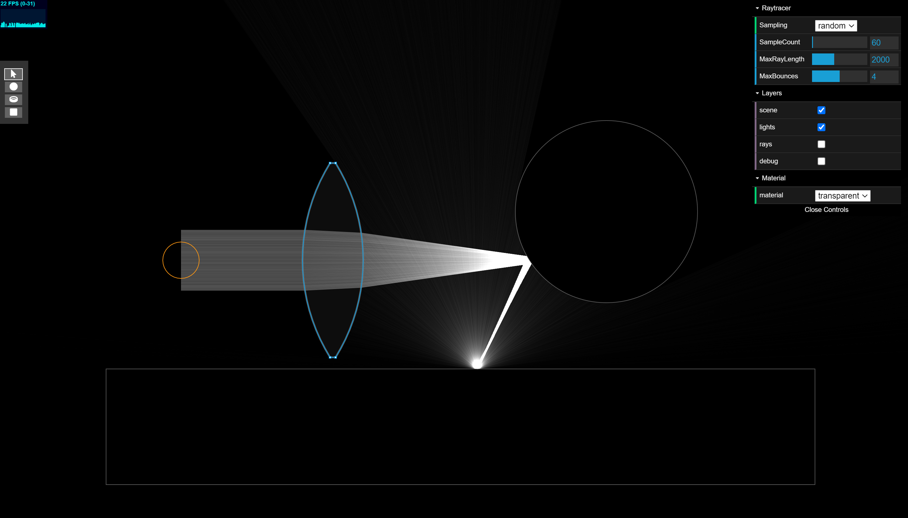

# Lighttracer2D

A 2d lightracer, with lens, mirror and diffuse materials.
I was experimenting how light would travel through space in 2 dimensions. Light decays much slower compared to 3D. The algorhitm shoot photons from light sources and simulate light bounce based on physics.

🟥 The demo was tested on chrome, desktop only.

working demo: https://zalavariandris.github.io/Lighttrace2D/

## Features
- laser, omni and directional light sources
- chosse 3 materials: transparent, mirror and diffuse
- progressive rendering
- select and move objects
- select and edit light sources and objects

## Todo
- [ ] pan and zoom
- [ ] responsive (support mobile)
- [ ] sample bsdf
- [ ] simulate light attentuation through third dimension
- [ ] color dispersion (prism)
- [ ] Sub surface scattering (milk like medum).
- [ ] Femtophotography: animate photons through time.
